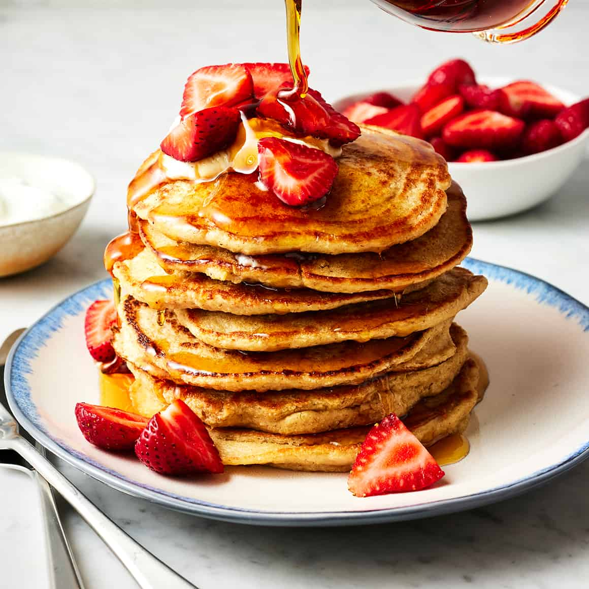

# Breakfast Food

Breakfast is often considered the most important meal of the day. It provides the *essential nutrients* and *energy* needed to start the day. Breakfast foods vary widely around the world, but common choices include **eggs, cereals, pastries,** and beverages like **coffee or juice**.

## Types of Breakfast Foods
Breakfast foods can be sweet or savory, and their popularity often depends on cultural and regional preferences.

### Sweet Breakfast Options

Sweet breakfast foods are favored in many cultures. They often include fruits, pastries, and sweetened cereals. Some popular examples are:

- **Pancakes**
- **Waffles**
- **French toast**
- **Pastries**

### Savory Breakfast Options

Savory breakfasts often include protein-rich foods such as eggs, meat, or cheese. Examples of savory breakfasts include:

- **Scrambled eggs**
- **Avocado toast**
- **Omelettes**
- **Breakfast burritos**

### Breakfast Beverages

Beverages also play a crucial role in breakfast meals. Some popular drinks include:

- **Coffee**
- **Juice**
- **Smoothies**
- **Milk**

## Global Breakfast Trends
Different countries have unique breakfast traditions. For example:

- In **Japan**, breakfast might include miso soup, rice, and fish.
- In **Mexico**, dishes like chilaquiles or tamales are common for breakfast.
- In **Scotland**, porridge (oatmeal) is a traditional morning food.

## See also
- [Resource 1](https://www.betterhealth.vic.gov.au/health/healthyliving/breakfast)
- [Resource 2](https://www.nytimes.com/2024/01/23/learning/breakfast.html)
- [Resource 3](https://www.nytimes.com/2023/04/23/well/eat/healthy-breakfast.html)

## References
1. Reference 1
2. Reference 2
3. Reference 3
